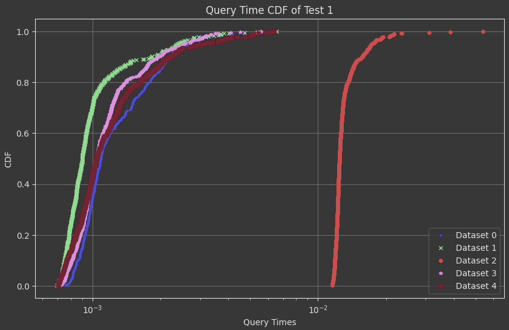
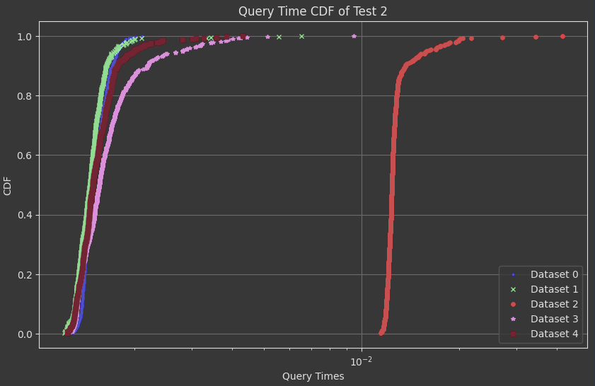

## Feature 1 Testing
This document explains how feature 1 was tested on the production database.
### Performance Tests
We will consider two possible workloads when designing our test cases. The first is the case where a user will want to compare the performance of drivers in the first half of a season versus the second half. Thus, one test should be a query for a recent season with the different between start and end being roughly half the number of rounds in the season. This is a reasonable assumption because many journalists would want to use this to compare say, the best drivers in the first half or second half, or perhaps use previous season's halves to predict the form of the drivers going forward.

Moreover, another use case would be to query the entire season's standings, or the points for a single race. These use cases should be obvious as a user would want to know the outcome of a race or season. 

### Performance Difference
The three tests used in gauging performance are in `testing.ipynb`, each being one of the three workloads as described above. To gauge performance, the Python `time` library was used to calculate the average times of each query, and 500 datapoints are gathered per query. Moreover, caching was disabled as it will interfere with accurate runtimes. The results are plotted in a CDF.

There are 4 optimizations that were used to test. Dataset 0 represents no optimization, dataset 1 represents indexes on the `season` attribute on both `races` and `points`, dataset 2 represents indices on the (finishing) positions on `results` and `points`, dataset 3 is both optimizations 1 and 2, and lastly, dataset 4 is optimizations 1 and 2, except the two indices on `points` were merged to be a multicolumn index.

Each dataset has about 500 points.
#### Test 1
Test 1 represents the query with 2021 as the season, 1 as the starting round, and 11 as the ending round. It represents the workload of querying roughly half a season.

Above shows the CDF of query 1
##### Dataset 0
- median latency is 0.0010898113250732422s
- tail latency (99th percentile) is 0.004199759960174558s
##### Dataset 1
- median latency is 0.0009011030197143555s
- tail latency (99th percentile) is 0.0037180352210998526s
##### Dataset 2
- median latency is 0.01244211196899414s
- tail latency (99th percentile) is 0.02174540281295775s
##### Dataset 3
- median latency is 0.0010399818420410156s
- tail latency (99th percentile) is 0.0035109519958496094s
##### Dataset 4
- median latency is 0.0010409355163574219s
- tail latency (99th percentile) is 0.005196785926818845s

#### Test 2
Test 2 represents the query with 2021 as the season, 1 as the starting round, and 22 as the ending round. It represents the workload of querying the entire season.

Above shows the CDF of query 2
##### Dataset 0
- median latency is 0.001485586166381836s
- tail latency (99th percentile) is 0.0018822503089904782s
##### Dataset 1
- median latency is 0.0014559030532836914s
- tail latency (99th percentile) is 0.0020049166679382315s
##### Dataset 2
- median latency is 0.012417435646057129s
- tail latency (99th percentile) is 0.02015174627304077s
##### Dataset 3
- median latency is 0.0015584230422973633s
- tail latency (99th percentile) is 0.004014444351196288s
##### Dataset 4
- median latency is 0.0014859437942504883s
- tail latency (99th percentile) is 0.0030197620391845697s

#### Test 3
Test 3 represents the query with 2021 as the season, 1 as the starting round, and 1 as the ending round. It represents the workload of querying a single race of a season.

Above shows the CDF of query 3
##### Dataset 0
- median latency is 0.0003190040588378906s
- tail latency (99th percentile) is 0.00047093391418457004s
##### Dataset 1
- median latency is 0.00018787384033203125s
- tail latency (99th percentile) is 0.0003233551979064941s
##### Dataset 2
- median latency is 0.012159109115600586s
- tail latency (99th percentile) is 0.020403800010681147s
##### Dataset 3
- median latency is 0.00029599666595458984s
- tail latency (99th percentile) is 0.00210789918899536s
##### Dataset 4
- median latency is 0.00026488304138183594
- tail latency (99th percentile) is 0.0005672049522399902s
### Conclusions
Ultimately, optimization 1 was the best performing one and that is the one we will implement. That being said, it seems modifying `points` was detrimental to performance, and this is likely because they already come in an order that logically makes sense.