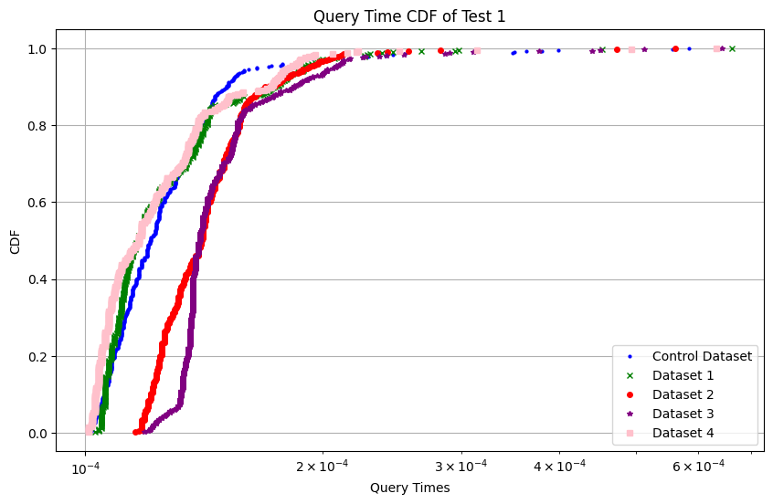

## Feature 2 Testing
This document explains how feature 2 was tested on the production database.
### Performance Tests
Due to how the feature works, there is generally only 1 possible workload. This is when a given driver exists in a given race, and thus their correct time deltas will be produced. This is a reasonable and useful assumptions because many teams would be interested in seeing the difference in a car's performance during the first lap of the race and their first lap out of the pit. A consistent negative delta could imply that the pit team is lacking in preparation, or a misjudge in weather conditions.

Futhermore, the number of outputted rows is also proportional to the number of times a driver pitted during the race. We can expect most racers to output exactly 3 rows (as this would imply 2 pits, which is the enforced minimum) however some input combinations result in only 2 or 1 rows. These instances imply that the driver was forced to withdraw before completing the race, either due to disqualification or injury.

### Performance Difference
The test used in gauging performance is in `testing.ipynb`, to test the workload as described above. To gauge performance, the Python `time` library was used to calculate the average times of each query, and 500 datapoints are gathered per query. Moreover, caching was disabled as it will interfere with accurate runtimes. The results are plotted in a CDF.

There are 4 optimizations that were used to test. Control Dataset represents no optimization, dataset 1 represents indexes on the `lapNumber`, `time`, and `enterPitTime` attributes from the `laps` table, dataset 2 represents indexes on the `dID` and `rID` attributes from the `laps` table, dataset 3 is both optimizations 1 and 2, and lastly, dataset 4 is composed of the optimizations from datasets 1 and 2, except the indicies for `dID` and `rID` were joined in a multicolumn index and the attributes `lapNumber`, `time`, and `enterPitTime` were also joined into a multicolumn index.

Each dataset has about 500 points.

To evaluate the performance, simply run `testing.ipynb`.
#### Test 1
Test 1 has the raceID = 1039, and the driverID = 136. This translates Lewis Hamilton's performance on the Bahrain International Circuit race from 2021.

Above shows the CDF of query 1
##### Dataset 0
- median latency is 0.00012111663818359375s
- tail latency (99th percentile) is 0.00035107135772705067s
##### Dataset 1
- median latency is 0.00011682510375976562s
- tail latency (99th percentile) is 0.00024602174758911114s
##### Dataset 2
- median latency is 0.0001404285430908203s
- tail latency (99th percentile) is 0.0002420759201049804s
##### Dataset 3
- median latency is 0.0001399517059326172s
- tail latency (99th percentile) is 0.0003117966651916498s
##### Dataset 4
- median latency is 0.0001169443130493164s
- tail latency (99th percentile) is 0.0002210235595703125s

### Conclusions
Ultimately, optimization 1 has the best median performance, while optimization 4 has the best worst-case performance. In reality, the difference is extremely small. This is likely due to the narrow scope of the query. For simplicity, no optimizations will be done.