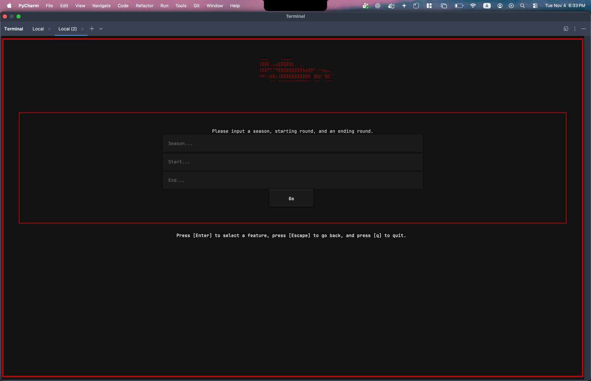
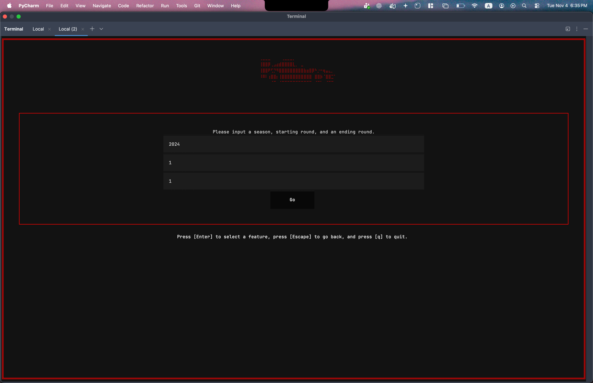
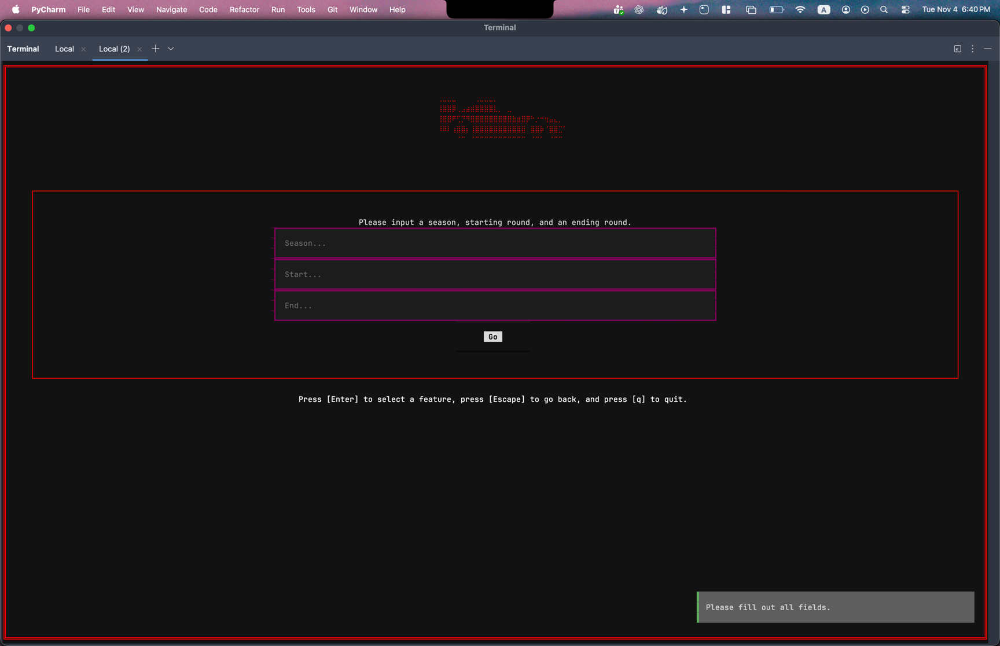
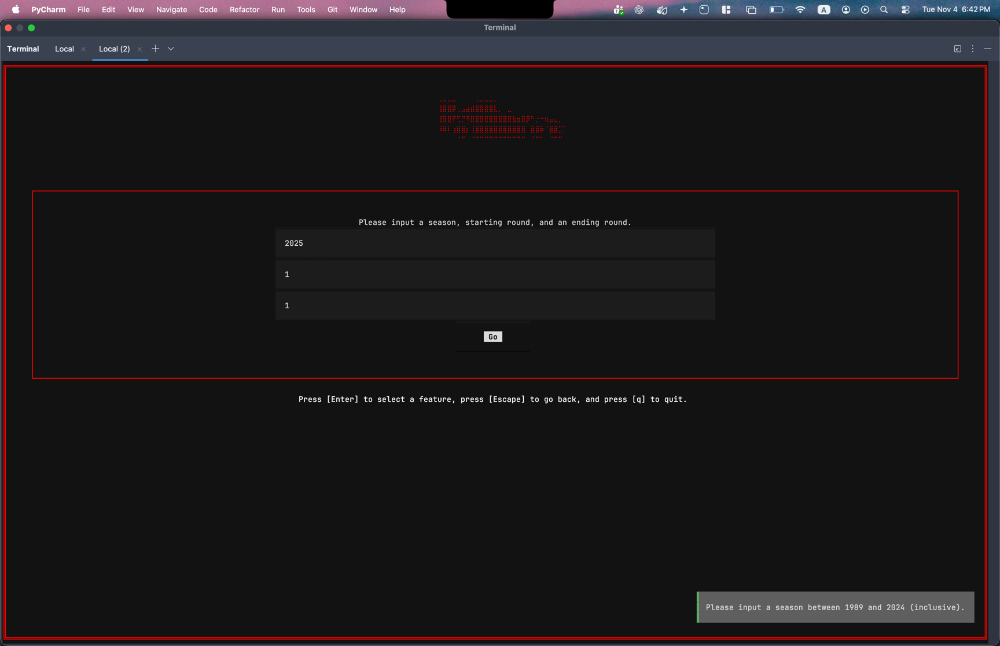
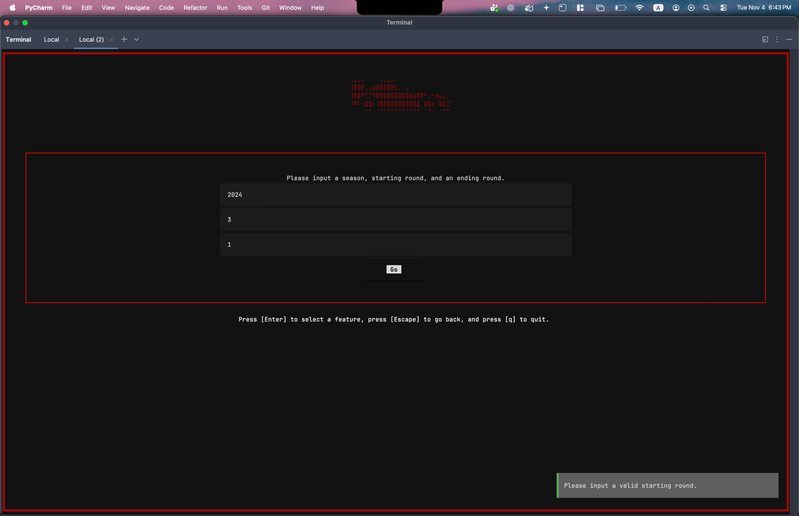
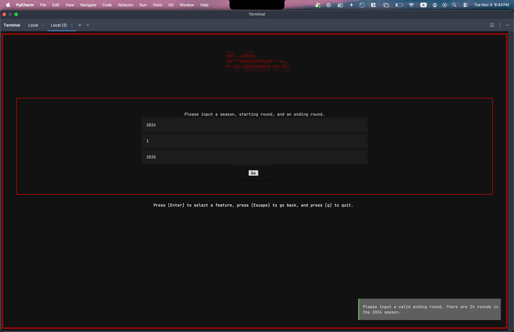

## Feature 1
This feature lets the user explore the form of all drivers given a time frame within a season.
### Interface Description
The interface will consist of three boxes that the user can submit a `season`, representing the season they would like to query, a `starting round`, and an `ending round`. In F1, races are ordered by rounds, so starting and ending round essentially mean between which two races in the season (inclusive) does the user want to examine.
### Users
The users of the interface will be people interested in exploring the form of all drivers given a time frame within a season. For example, they can be trivia nerds, journalists, or people that want to place a bet and need to see recent form.

The user will interact with the interface by entering their desired parameters into the boxes, then clicking the button, and the screen will refresh with the desired data.
### Snapshots
Here we will show the happy path of the feature. First, witness the feature's query screen where the user can input their desired fields.

Filling in a potential query.

Upon clicking go, the user will be redirected to a table containing their query results.

There is also details regarding correctness of the feature with corresponding snapshots, which will be discussed in the following section.
### Testing
#### Test 1
The feature is disabled when data has not been loaded into the database.

#### Test 2
The feature, upon exiting and re-entering, will have all state wiped.

#### Test 3
The feature will not allow the user to submit if they have left field(s) blank, and will give them a message.

#### Test 4
The feature will not the user to submit an invalid year.

#### Test 5 
The feature will not allow the user to submit an invalid starting round.

#### Test 6
The feature will not allow the user to submit an invalid ending round.

#### Test 7
The feature is correct over an entire season.

___