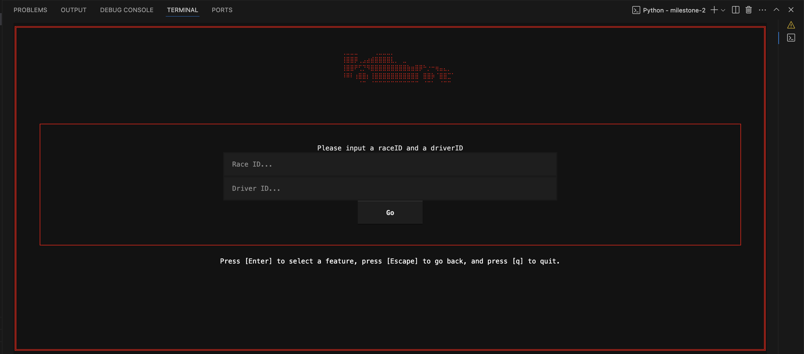
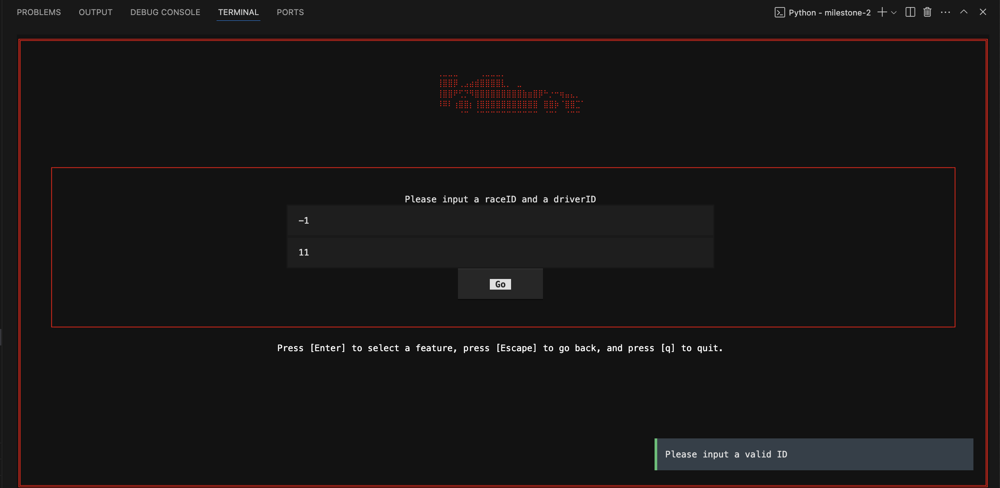

## Feature 3
This feature allows the user to get the time difference between a selected driver's first lap and pit laps, for a selected race.
### Interface Description
The interface will consist of 2 boxes that the user can submit a race (rID), representing the race they want to query, and a driver (dID), representing the driver of interest. The delta is calculated using the equation: `first_lap_time - pit_lap_time`, so a positive delta implies that the pit lap is faster than the first lap.
### Users
The users of the interface will include motorsport enthusiasts, analysts, and bettors who want to examine a driver's performance within a given timeframe during a season. Users could be trivia enthusiasts, journalists researching a story, or sports bettors analyzing recent driver form.

The user will interact with the interface by entering their desired parameters into the boxes, then clicking the button, and the screen will refresh with the desired data.
### Snapshots
Here are screenshots of the feature. First, the feature's query interface (TUI) where users can input their desired fields to learn about Pit Deltas.

Filling in a query.

Upon clicking 'Go', the user will be redirected to a table containing the results of their query.

Next are details regarding the correctness of the feature with snapsshots attached.
### Testing
#### Test 1
The feature is disabled when the data has not been loaded into the database.

#### Test 2
The feature, upon exiting and re-entering, will have all state wiped.

#### Test 3
The feature will not allow the user to leave a blank field, and will provide a warning.

#### Test 4
The feature will not allow the user to enter an invalid raceID or driverID, and will provide a warning.

#### Test 5
The feature will not execute the query if a driver with driverID did not actually race in the race with raceID, and will provide a warning.

#### Test 6
The feature is correct over the sample database.
